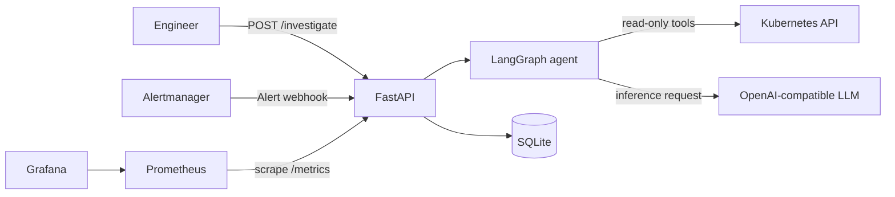

# KumoShindan

**KumoShindan** (雲診断, “cloud diagnosis”) is a read-only, AI-assisted Kubernetes incident investigator. It gathers evidence from a Kubernetes cluster—such as Pod status, events, logs, PVCs, and Service endpoints—and returns a structured report with a likely cause, supporting evidence, and suggested next steps.

KumoShindan does not change cluster resources or execute remediation commands.

## What it demonstrates

- Kubernetes troubleshooting with 10 deliberately broken workload scenarios
- A LangGraph investigation workflow with read-only Kubernetes tools
- Namespace allowlisting and least-privilege Kubernetes RBAC
- A FastAPI interface for manual investigations and investigation history
- SQLite persistence for investigation reports
- Prometheus metrics, a Grafana dashboard, and Prometheus alert rules
- Docker image builds, Helm deployment, and GitHub Actions CI

## Architecture



## Troubleshooting scenarios

The repository includes scenarios for:

| Scenario | Expected diagnosis |
|---|---|
| `crashloop-missing-env` | Missing environment variable |
| `imagepull-bad-tag` | Container image pull failure |
| `oomkilled` | Container exceeded its memory limit |
| `pending-insufficient-cpu` | Insufficient CPU resources |
| `pending-node-selector` | Pod scheduling constraint |
| `pvc-bad-storageclass` | Persistent volume claim cannot bind |
| `service-selector-mismatch` | Service selector does not match Pod labels |
| `readiness-probe-fail` | Readiness probe failure |
| `liveness-probe-kill` | Liveness probe causes container restarts |
| `missing-configmap` | Required ConfigMap is missing |

Scenarios are intentionally faulty and are for a disposable development cluster. Apply and investigate one scenario at a time.

## Prerequisites

- Linux, macOS, or Windows with WSL2
- Docker
- A Kubernetes cluster and a working `kubectl` context
- Helm
- Python 3.10 or later
- An OpenAI-compatible LLM endpoint and API key
- `kind` if you want to build and load the image into a local kind cluster

Prometheus and Grafana are optional for running the API. They are needed for the monitoring dashboard and alerting features.

## Local development

Clone the repository and enter it:

```bash
git clone https://github.com/SanjanaMShetty/kumo-shindan.git
cd kumo-shindan
```

Create a virtual environment and install the project with development dependencies:

```bash
python3 -m venv .venv
source .venv/bin/activate
python -m pip install --upgrade pip
pip install -e ".[dev,openai]"
```

Create a local `.env` file:

```bash
cp .env.example .env
```

Edit `.env` and set these values using the model ID and OpenAI-compatible endpoint provided by your LLM service:

```env
LLM_PROVIDER=openai
LLM_MODEL=<provider-model-id>
LLM_BASE_URL=<provider-openai-compatible-base-url>
OPENAI_API_KEY=<your-api-key>
ALLOWED_NAMESPACES=kumoshindan-lab
```

Replace the placeholders with your provider values. Keep `.env` private; never commit it or share your API key.

Run the API locally:

```bash
uvicorn kumoshindan.api.main:app --reload
```

The API documentation is available at [http://localhost:8000/docs](http://localhost:8000/docs).

The API process must be able to reach the Kubernetes cluster. Locally, it uses the current `kubectl` context. In Kubernetes, it uses its ServiceAccount and RBAC permissions.

## Run an investigation

Check the API health:

```bash
curl -fsS http://localhost:8000/health
```

Submit an investigation:

```bash
curl -sS -X POST http://localhost:8000/investigate \
  -H 'Content-Type: application/json' \
  -d '{"namespace":"kumoshindan-lab","symptom":"The payments-web deployment has no ready Pods. Investigate the cause using Kubernetes evidence."}'
```

The response contains an investigation ID. Use it to retrieve the completed report:

```bash
curl -sS http://localhost:8000/investigations/INVESTIGATION_ID
```

You can also list recent investigations:

```bash
curl -sS http://localhost:8000/investigations
```

Replace `INVESTIGATION_ID` with the ID returned by the submission request.

## Run a troubleshooting scenario

The scenario script applies a selected faulty workload in the `kumoshindan-lab` namespace. For example:

```bash
scripts/scenario.sh apply imagepull-bad-tag
kubectl get pods -n kumoshindan-lab
```

Submit an investigation for the scenario through the API. When finished, remove the scenario resources:

```bash
scripts/scenario.sh delete
```

Use a disposable development cluster. Some scenarios intentionally create failing or pending workloads.

## Evaluation

The evaluation harness compares the agent's report with expected categories and evidence keywords. It needs a reachable LLM endpoint and may consume API quota.

Run the local checks:

```bash
.venv/bin/ruff check .
.venv/bin/ruff format --check .
.venv/bin/pytest -q -m "not llm and not cluster"
```

Run one scenario evaluation after applying that scenario:

```bash
.venv/bin/python eval/run_eval.py --only imagepull-bad-tag
```

See `eval/expected.yaml` for all cases and their expected outcomes.

## Kubernetes deployment

KumoShindan can be deployed using the Helm chart at `deploy/helm/kumoshindan`. The chart expects an existing Kubernetes image and an existing Kubernetes Secret containing the LLM API key.

Build and load a local image into a kind cluster. Adjust the cluster name and image tag if yours differ:

```bash
docker build -t kumoshindan:0.1.3 .
kind load docker-image kumoshindan:0.1.3 --name kubesleuth
```

Create the namespace and a Secret without printing the key in the terminal:

```bash
kubectl create namespace kumoshindan --dry-run=client -o yaml | kubectl apply -f -

read -rsp "LLM API key: " LLM_API_KEY
echo
kubectl create secret generic kumoshindan-llm-groq \
  --namespace kumoshindan \
  --from-literal=OPENAI_API_KEY="$LLM_API_KEY" \
  --dry-run=client -o yaml | kubectl apply -f -
unset LLM_API_KEY
```

Install or upgrade the release:

```bash
helm upgrade --install kumoshindan deploy/helm/kumoshindan \
  --namespace kumoshindan \
  --set image.tag=0.1.3 \
  --set existingSecret=kumoshindan-llm-groq \
  --wait --timeout 5m
```

Check the rollout and application health:

```bash
kubectl get pods,svc,pvc -n kumoshindan
kubectl rollout status deployment/kumoshindan -n kumoshindan --timeout=180s
kubectl port-forward -n kumoshindan svc/kumoshindan 8000:8000
```

In another terminal, check the API at [http://localhost:8000/health](http://localhost:8000/health) and the interactive API documentation at [http://localhost:8000/docs](http://localhost:8000/docs).

The chart values and RBAC rules are in `deploy/helm/kumoshindan`. Review them and adapt the image, Secret, allowed namespaces, and monitoring settings to your cluster.

## Monitoring

The application exposes Prometheus metrics at `/metrics`. The Helm chart includes a ServiceMonitor and Grafana dashboard resources. Prometheus Operator and Grafana must be installed and configured to discover them.

Example metrics include investigation outcomes and duration, current investigations, LLM token counts, and Kubernetes tool calls. Alert rules cover common Pod and PVC failure states.

## Security notes

- Kubernetes tools are read-only; the agent cannot apply fixes.
- Access is limited by the configured namespace allowlist and Kubernetes RBAC.
- The chart uses a dedicated ServiceAccount with read-only permissions.
- Store provider credentials in environment variables or Kubernetes Secrets.
- Never commit `.env`, API keys, or other credentials.
- Review every suggested command before running it.

## Limitations

- LLM diagnoses can be incomplete or incorrect; check the cited Kubernetes evidence.
- The evaluation suite covers the included scenarios and is not a guarantee of production accuracy.
- SQLite is suitable for this project demonstration; it is not a high-availability database.
- The project is a learning and portfolio project, not a replacement for incident response procedures.
